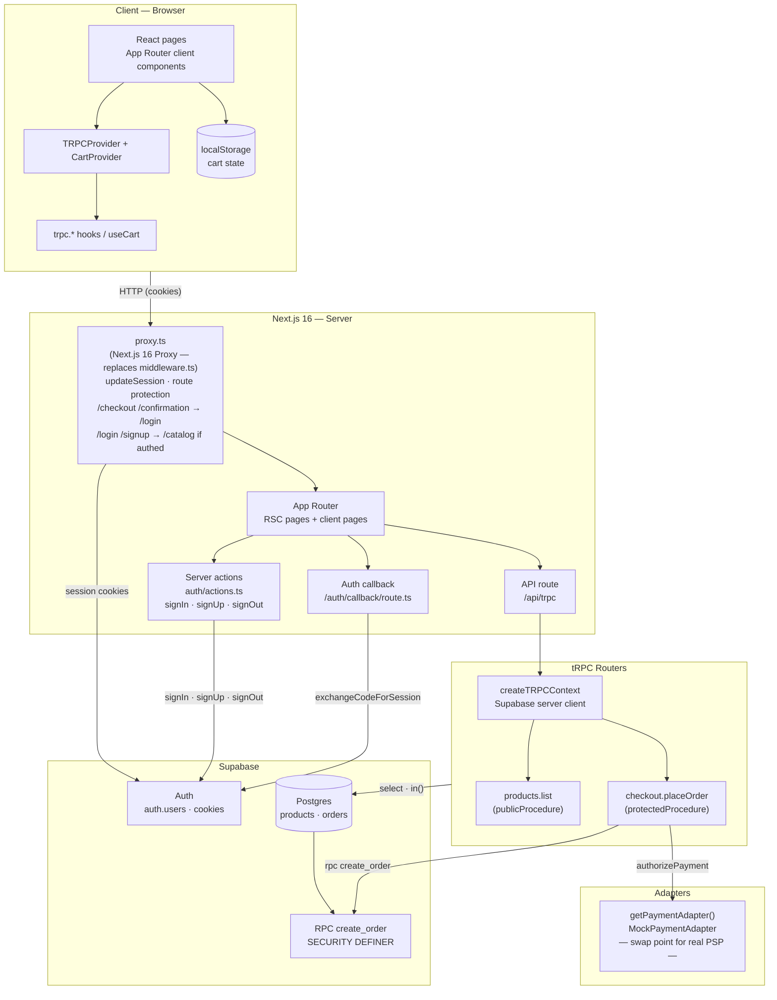

# Shopmind architecture

Shopmind is a Next.js 16 App Router application. Every inbound request passes through an auth/session proxy layer (`src/proxy.ts`) before reaching route handlers or pages. In Next.js 16, data fetching uses tRPC over HTTP, backed by a Supabase Postgres database; the client-side cart is persisted in `localStorage` only.

## Notes

- **Cart state** lives entirely in the browser (`localStorage` key `shopmind-cart-v1`). It is never sent to the server except as part of a `checkout.placeOrder` mutation.
- **Order creation** goes exclusively through the `create_order` Postgres function (security definer). Direct `INSERT` on `orders` is revoked for all client roles.
- **Prices and stock** are re-validated server-side inside `checkout.placeOrder` — cart line prices are snapshotted at add-time and may differ from current catalog values.
- **`MockPaymentAdapter`** always authorizes. Replace `getPaymentAdapter()` in [`src/lib/payments/index.ts`](src/lib/payments/index.ts) to wire a real payment provider.
- **`proxy.ts`** — is the network boundary entry point picked up automatically by the framework on every request. It refreshes the Supabase session cookie (keeps JWTs alive), guards `/checkout` and `/confirmation` behind auth, and redirects already-signed-in users away from `/login` and `/signup`.
